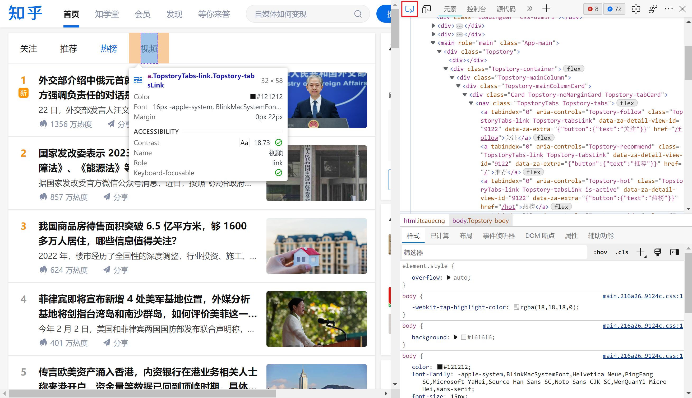

# 网页调试

对于前端开发者，在浏览器中使用开发者工具进行网页调试是必备的技能。

点击键盘上的 F12，在“元素”页，你可以轻松调试网页中的元素和样式表，快速定位某一 HTML 网页元素。图中用红框圈出来的按钮点击后可以选中网页中某一个具体的元素，以获取它的详细信息。

在“网络”页，你可以查看所有网络请求的负载、相应与性能情况。实际上，很多爬虫也是这样工作的，相比于直接从网页上获取信息，这些爬虫开发者会查看网页与服务器之间的网络请求，并通过直接调用这些请求来获取信息。并且，对于一些保密性做得不太好的网站，其实你有时候也可以在这里看到一些本不该被你看到的信息。

而如果网页使用了特定的网页框架，如 React 或 Vue 等进行开发，通常推荐安装相应的浏览器插件以便调试。

