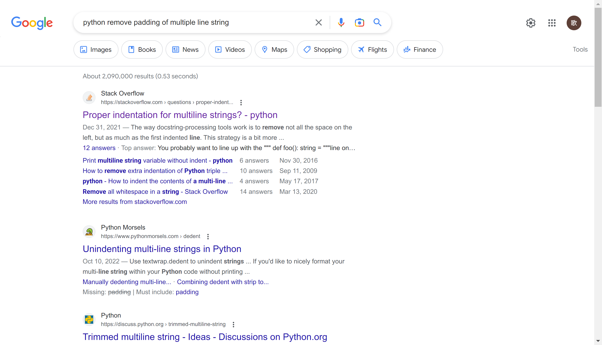
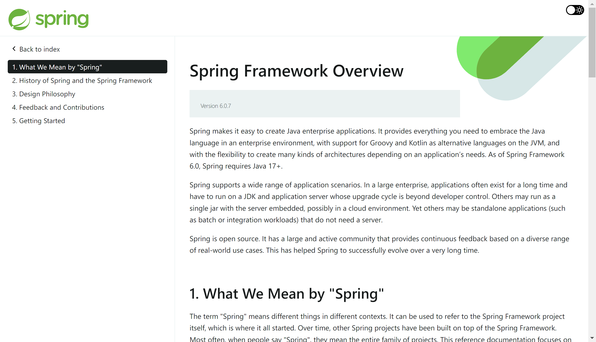

# 学会获取信息

## 学会使用英文搜索信息

使用英文进行检索是比使用中文检索要**有效率得多**的方式。这主要是由于中文程序员社区存在大量重复性较高且过时的信息。对于常见的问题，直接将错误信息粘贴到百度或许能够解决问题。但我们总会遇到稍小众一些的问题，并且很多时候中文社区容易找到过时的信息，且没有充分的解释，容易产生误导。因此，学会使用英文检索是必须的。

对于英文搜索，一般推荐使用 Google。然而，受限于国内的网络环境，使用必应搜索也是一个不错的选择，并且记得使用必应国际版。

上面是一个例子，展示了使用 Google 搜索一个常见编程问题的例子。可以看到，第一个搜索结果来自 Stack Overflow，这是一个知名的英文程序员问答网站，你总是能在上面看到简洁明了且不过时的答案。并且，你可以看到这些回答中许多都包含了对问题背后原理的解释，这对于你理解问题的本质有很大的帮助。

即使你英文水平不佳，我也建议你尝试使用英文搜索，即便是借助于翻译工具搜索问题与阅读答案。因为英文资料往往提供了更新且更有价值的信息。并且，在一段时间的英文搜索之后，你会发现自己的英文水平也会有所提高。毕竟，英文中和计算机相关的词汇本就不多，我想任何一个能过英语四级的人都能在一段时间的熟悉之后习惯使用英文搜索。

不要畏惧英文搜索，这做起来其实比听起来简单得多。从现在就开始学着习惯使用英文搜索信息，只要坚持两三天，你就会意识到这样做的必要性与意义。

## 阅读官方文档

官方文档永远是最好、或者说至少是较好且稳妥的学习选择。阅读文档应当是一个计算机行业从业者所需的基本素养，并且应当尽量阅读官方的英文文档，因为中文文档总是存在翻译不及时产生的信息过时问题，而这有时候会带来更多的麻烦。

下面是前端流行框架 React 推出的最新官方文档。可以看到，它提供了一个叫做“Quick Start”的部分，帮助你快速入门这一框架。很多现代的编程语言、框架等都提供类似于“Quick Start”的部分，帮助你在几分钟至一小时不等的时间内快速掌握该语言或项目的基本用法，并且能够独立用这些知识编写一个完整的项目。而有些更人性化的文档，比如这里 React 的最新文档，还提供了交互式的代码编辑体验，你可以直接修改示例代码，并看到代码的展示效果，这对增进理解很有帮助。

可以看到，阅读文档并没有许多人想象的那么困难。许多现代的文档都为降低阅读门槛和提升阅读体验做了很大的努力，以至于现在的许多文档比起一份详尽冗长的“文档”，其实更接近于一份友好的“入门教程”。在这种情况下，如果文档已经很棒了，那么阅读文档通常就足够了，去阅读他人基于文档加工的二三手信息入门，反而不是个理智的选择。

而下图则展示了 Java 后端框架 Spring 的官方文档。该文档比起 React 这样的前端框架的文档要更枯燥与逊色一些，但也包含“Getting Started”部分，以指导读者快速入门 Spring 框架的使用。

