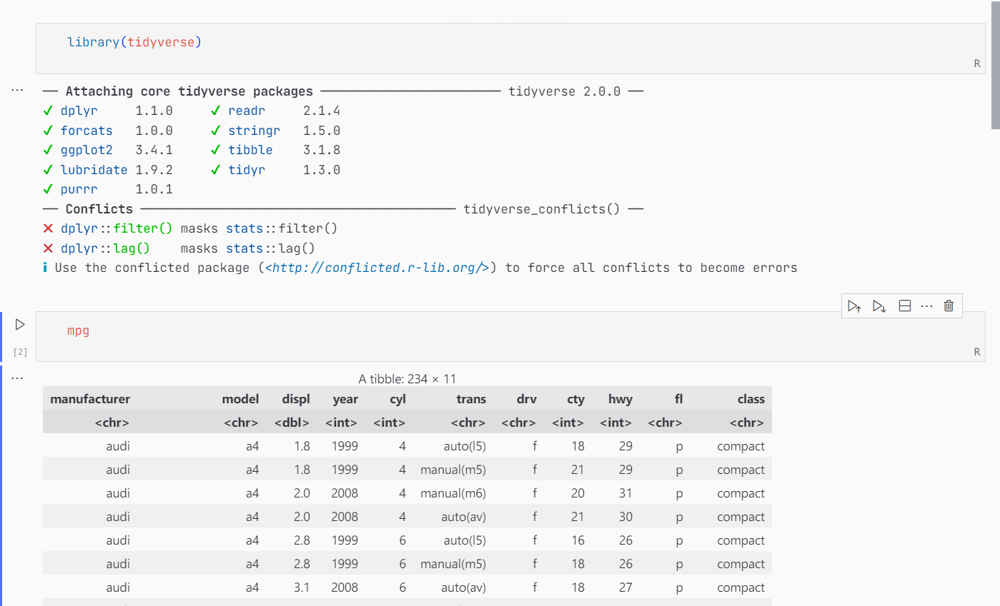

# Jupyter Notebook

Jupyter Notebook 是一种常用的**交互式编程**方式，尤其常见于数据科学领域。在 Jupyter Notebook 中，我们可以将代码段放在不同的单元格中，并且以任意顺序执行这些代码，同时看到（并保存）每一个单元格的输出结果。这种自由且方便的形式很受数据科学家喜爱。上图演示了 VS Code 中 Jupyter 的使用。

同时，Jupyter 还会通过变量表来补充智能提示。当你运行了某一个单元格后，其中你定义的变量会保存到变量表中，此时当你在 Jupyter 中编写代码时，就可以获取这个变量上的智能提示。这对于一些动态类型语言，例如 Python 来说，是非常方便的。

尽管人们常常将 Jupyter 与 Python 结合使用，但需要注意的是 Jupyter 并非仅适用于 Python。你可以通过为 Jupyter 安装其他编程语言的“**内核（Kernel）**”来将 Jupyter 应用于其他语言。这里是一个包含了大多数已经存在的[Jupyter Kernel 列表](https://github.com/jupyter/jupyter/wiki/Jupyter-kernels)。

下面简单演示了将 Jupyter 与 R 语言一起使用。

